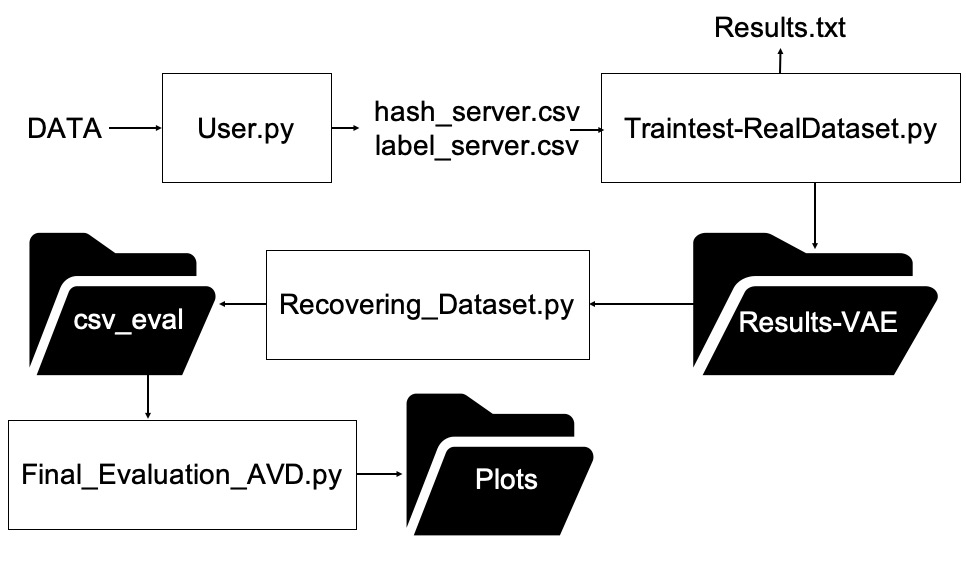

# LDP-VAE

This repository contains the information necessary to reproduce the results submitted for the [NHANES dataset](https://wwwn.cdc.gov/Nchs/Nhanes/2015-2016/) at the [NSS 2023](https://nss-socialsec2023.cyber.kent.ac.uk/) conference

In these experiments, we propose using VAE in the LDP approach.

User.py encodes user data using hash functions, as suggested in LoPub.

Vae_TrainTest-RealDataset.py trains all the attributes available in the dataset. Then, the original dataset is encoded and perturbed to be analyzed using the latent space created by VAE. Results.txt contains the validation error of the VAE training step for each attribute.

Results-VAE combines the attributes created by VAE.

Recovering_Dataset perturbs the original dataset and computes the probabilities using VAE. The folder "csv_eval" contains the perturbed dataset.

Final_Evaluation_AVD.py computes LASSO and AVD distances, and the results are saved in the folder Plots.

This experiments were run on a machine with Intel Core i7-12700H  with a GPU NVIDIA GeForce RTX 3070Ti

Python 3.9.12 and CUDA version 11.6

pip list is available in requierements.txt
